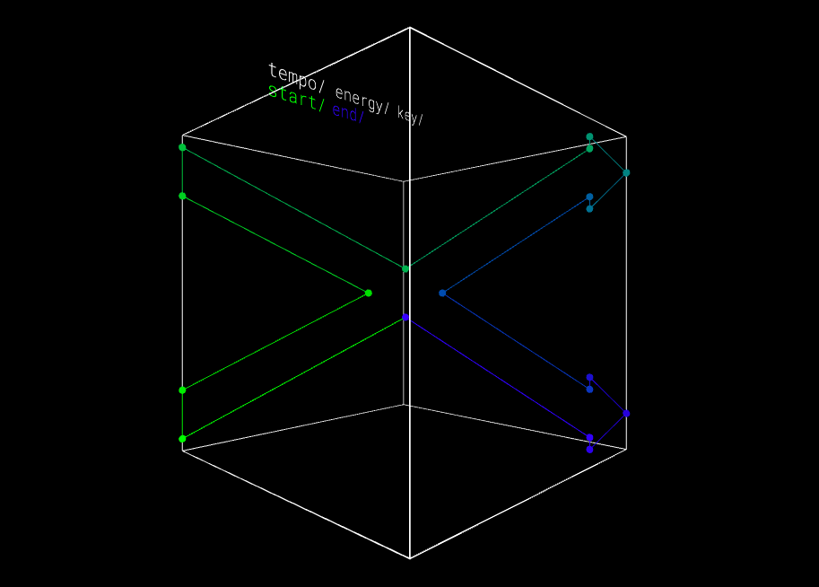
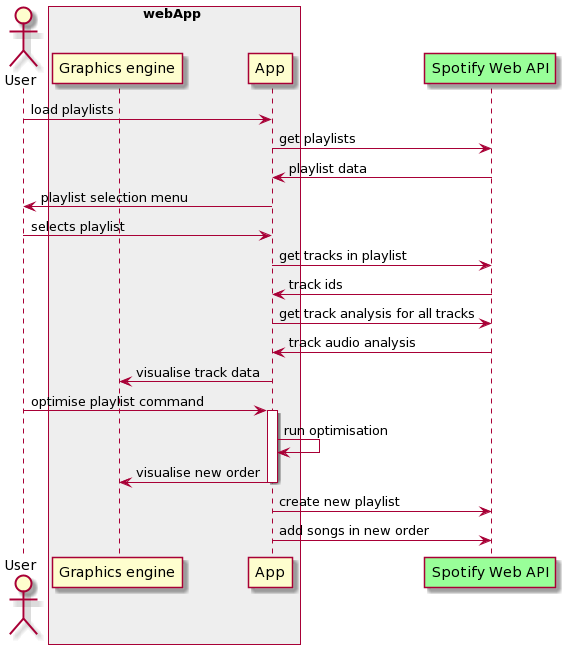
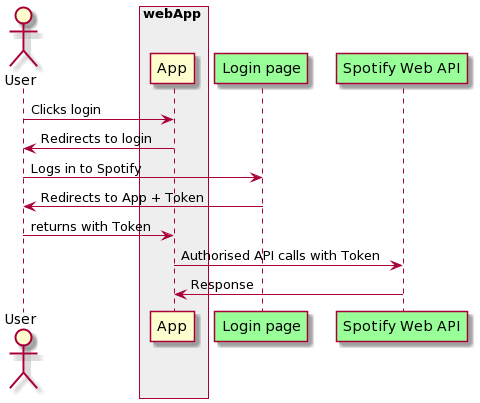

# Smart Shuffle
### Grant Holtes 2021
Reorder playlists to minimise the differences between songs based on Spotify audio analysis data. This is entirely done on the frontend, with no backend required or used.

#### Try it here: [grantholtes.com/smartshuffle](www.grantholtes.com/smartshuffle])

 
#### High level process
There are 3 key steps:
1. Access the users playlists, tracks and track analysis
2. Find a optimal order for the tracks
3. Create a new playlist with the tracks in this optimal order
 
Its also neat to visualise this audio analysis data that is usually hidden from the user, so there is also a 3D graphic that is rendered on the fly as more data is gathered.
 
## Background
Spotify is a fantastic service which has drastically changed how we find, listen and share music. Their tech forward approach has also allowed new features to be  released that further elevate their user’s ability to interact with their music, such as the ‘discover weekly’ playlist or the recently released [blend](https://newsroom.spotify.com/2021-08-31/how-spotifys-newest-personalized-experience-blend-creates-a-playlist-for-you-and-your-bestie/) tool that merges two people’s music tastes into a single playlist. 

At the heart of the spotify user experience is the playlist, which allows the user a way to catalogue and organise songs in a manner reminiscent of the cassette mixtapes of the 1980s. Without playlists the listening experience on spotify would be a transient one, with users needing to search through the endless library of tracks to find “their” music. As such playlists provide the user with some level of ownership and control over what is “their” music in a system with no ownership and a universe of music and genres. 

Given the importance of playlists and the mechanism by which new songs are added to a playlist (just slap them on the end), it is unsurprising that personal playlists can quickly become incoherent, a consequence of evolving tastes and the level of effort required to reorder and reorganize songs. 

To avoid this fate for my own playlists, I have started to build solutions to this issue through using Spotify’s developer tools to create my own methods to interact with the Spotify music universe. 

## Spotify access
Spotify offers a free Web API that allows you to programmatically access various aspects of Spotify and modify parts of a user’s account - given their permission at least!

### Web API
I want to be able to access a user’s playlists and tracks within, as well as be able to modify these playlists or create new ones. This requires 4 key abilities:
* Ability to list all of a users playlists
* Ability to list the tracks within a playlist
* Ability to get data about a track
* Ability to create or modify a user’s playlist

Fortunately the web API offers all of these functions (and many more), as well as the ability to bundle many requests into a single HTTPS call, which reduces the number of requests required when loading track data on all tracks within a playlist.

For reference, the required playlist level interactions are contained within the [Playlist API](https://developer.spotify.com/documentation/web-api/reference/#category-playlists) while the track level interactions are contained within the [Tracks API.](https://developer.spotify.com/documentation/web-api/reference/#category-tracks)

The basic flow can be summarized as below:

### Authorisation  
For any of the API features to be useful, the user must be logged in as a valid spotify user. Spotify provides a number of ways for a user to log in and provide the application with the required authorisation to access their data and make changes. 

For my applications I have chosen to use the “implicit grant” method as I do not need long-term persistent authorisation and as implicit grant authorisation allows the application to be front-end only. This flow provides the application with a token that is then used in all subsequent API calls.

### Pagination 
Due to the large number of playlists and songs a user may have, all of the used API calls have a maximum return length as well as pagination to get the next chunk of data if any exists. This keeps the size of each api call manageable, especially when the data is contained within the URL parameters rather than headers, and so is subject to the strict character limits by browser. 

## Order optimisation
User’s spotify playlists tend to be chronologically organised by the date when a song is added, which does not typically lead to a well ordered playback. When seeking to improve this order, it helps to reframe the problem as “what order should we play the songs such that every subsequent song is acceptably similar to the previous song”. 

It is easy to determine how similar two songs are given the Spotify audio analysis data, which includes measurements of tempo, key, as well as more subjective measures such as “danceability” and “acousticness” which capture the sound and mood of the song. If a set of these measures are stored as vectors for each song, the similarity between songs can be quantified as the distance between these vectors. Two songs that are nearby as measure by their vectors should have a similar BPM, key and general mood, while songs that are further apart may be very different and so unsuitable to play back-to-back.

The task of ordering the songs of the playlist to minimise the sum of the distance between sequential songs is verison of the [traveling salesman problem, TSP](https://en.wikipedia.org/wiki/Travelling_salesman_problem), which seeks find a route between cities that minimise the total distance traveled. The only major difference is that instead of a 2D space, we have an arbitrary number of dimensions.

Finding an exact solution to the TSP is a famously NP-hard problem, which requires an infeasible amount of computational power for larger numbers of data points. The complexity of the TSP is O(n!), which becomes impractical beyond ~20 data points, and even optimised versions are impractical beyond ~50 data points.  As we don’t know how long a user’s playlist may be, seeking an exact solution is unacceptable. 

Instead an approximate solution is used, in this case a simple nearest neighbours approach is used which has a complexity of O(n squared). 

Select a point. Append the point to the output array and mark it as seen.
While there are unseen points, find the nearest point by looping over all unseen points and measuring the distance from the current point to the other point. 
Set the current point to be the nearest point, and append it to the output array and mark it as seen.
Return the output array

This greedy approach is far from optimal, but is significantly faster and simpler than competing approaches, and is well suited to this application where speed is preferred over an exact solution. An additional perk of this method is that every starting point yields a slightly different approximate solution, which allows the user to shuffle between approximately optimal solutions by simply recomputing the solution, given that the starting point is randomly chosen. When this is combined with a visualisation of the solution, it allows the user to pick the solution they like the look of best. 

